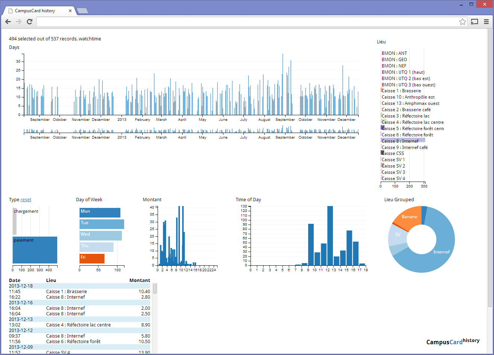

CampusCard Visualization
========================

Personal CampusCard expense history visualization with d3.js dc.js and crossfilter.js

Workflow
--------

[parse/parse_campuscard_data_from_myunil.py](parse/parse_campuscard_data_from_myunil.py) parses data from university portal into database.
[api.groovy](api.groovy) generates a json file like shown in [sample_api_data.json](sample_api_data.json), which is used by dc.js/crossfilter to generate interactive d3.js charts.

Screenshot
----------
